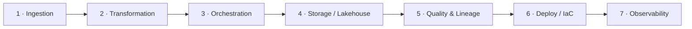

# The Data Engineering Ecosystem, Explained

> **The big idea:** Data engineering isn't about mastering one tool. It's about understanding how the **right tools work together** — across ingestion, transformation, orchestration, storage, quality, deployment, and observability.

Most people learn tools in isolation: "I know Spark," "I know Airflow." But real data engineering is knowing **which tools pair up to solve a specific problem**, and **how data flows between them**. This guide walks the whole pipeline, one stage at a time, with the tool combinations worth knowing at each step.

*The whole journey at a glance — raw sources on the left flow through all seven stages to insight on the right. The dots are data moving through the pipeline; each card is a stage with its go-to tool combinations.*

*Data flows left → right. Each stage pairs tools that solve one job together.*

---

## Think in stages, not tools

A production data platform is a **pipeline**. Raw data enters on one side and trustworthy, query-ready data comes out the other — passing through seven jobs along the way:

The skill is matching the right **tool pairing** to each job — and understanding the handoffs between them.

---

## Stage 1 · Ingestion — getting data in

This is where data **enters** your platform — from databases, apps, APIs, and event streams. The challenge is capturing it reliably, often in near real time.

- **Kafka + Debezium** → **Change Data Capture (CDC).** Debezium watches your database's change log and streams every insert/update/delete into Kafka — so downstream systems see changes within seconds, without hammering the source DB.
- **Kafka + Flink** → **Real-time stream processing.** Kafka carries the event stream; Flink processes it with low latency (windowing, joins, aggregations on data in motion).
- **Airbyte + dbt** → **ELT data pipelines.** Airbyte pulls data from hundreds of sources into your warehouse; dbt then transforms it in place.

> **The handoff:** raw events and records land in a stream or landing zone, ready to be shaped.

---

## Stage 2 · Transformation — shaping the data

Raw data is messy. Transformation cleans, joins, and reshapes it into something useful. The right tool depends on **data size**.

- **Python + Pandas** → **Data cleaning & transformation.** Perfect for small-to-medium datasets that fit in memory — quick cleaning, feature prep, and exploration.
- **Python + PySpark** → **Distributed data processing.** When data is too big for one machine, PySpark spreads the work across a cluster.
- **SQL + dbt** → **Analytics engineering.** dbt turns SQL into **reliable, testable, version-controlled** transformations — the modern way to build analytics models in the warehouse.

> **Rule of thumb:** Pandas for small, PySpark for massive, dbt for warehouse-native SQL transforms.

---

## Stage 3 · Orchestration — making it run on schedule

Pipelines have many steps with dependencies. Orchestration **schedules, automates, and coordinates** them, and retries on failure.

- **Airflow + Python** → **Pipeline orchestration.** Airflow defines pipelines as DAGs (directed graphs of tasks) in Python — scheduling runs, managing dependencies, and handling retries.
- **Docker + Airflow** → **Portable, reproducible pipelines.** Package each task in a container so it runs identically on a laptop, in CI, or in production — no "works on my machine."

> **The handoff:** the orchestrator decides *what runs when*, triggering ingestion and transformation in the right order.

---

## Stage 4 · Storage & the Lakehouse — where data lives

Transformed data needs a home that's **scalable, open, and query-friendly**. The modern answer is the **lakehouse** — cheap object storage with database-like table features (ACID, schema, time travel).

- **S3 + Apache Iceberg** → **Open data lakehouse.** Store data as open Iceberg tables on S3 — no vendor lock-in, with transactions and schema evolution.
- **Spark + Apache Iceberg** → **Scalable lakehouse processing.** Spark reads/writes huge Iceberg tables for batch and large-scale jobs.
- **Snowflake + dbt** → **Cloud ELT workflows.** Load into Snowflake, transform with dbt — a clean, managed modern-data-stack pattern.
- **Databricks + Delta Lake** → **Unified lakehouse platform.** One place for engineering, analytics, and ML, with Delta Lake providing reliable, transactional tables.

> **The idea:** keep storage **open** (Iceberg/Delta) so any engine can read it, and pick the compute that fits your workload.

---

## Stage 5 · Quality & Lineage — can you trust the data?

A pipeline that runs but produces **wrong** data is worse than one that fails loudly. This stage catches problems and tracks where data came from.

- **Great Expectations + Python** → **Data quality testing.** Define "expectations" (e.g. *this column is never null*, *values are in range*) and catch bad data **before** it reaches dashboards or models.
- **DataHub + OpenLineage** → **Metadata & data lineage.** Track ownership, schemas, and the full lineage of how each table was produced — so you can answer "where did this number come from?" and assess the blast radius of a change.

> **Why it matters:** trust is the product. Quality gates + lineage are what make a platform dependable.

---

## Stage 6 · Deployment & Infrastructure as Code

Your pipelines and the infrastructure they run on should be **reproducible and reviewable** — defined in code, not clicked together by hand.

- **Terraform + Cloud** → **Data infrastructure as code.** Provision warehouses, buckets, clusters, and permissions declaratively, versioned in Git.
- **Git + CI/CD** → **Pipeline deployment.** Review pipeline changes in pull requests and ship them automatically through a pipeline — safe, repeatable releases.

> **The payoff:** you can rebuild the whole platform from Git, and every change is reviewed before it goes live.

---

## Stage 7 · Observability — knowing it's healthy

You can't operate what you can't see. Observability tells you whether pipelines are running, failing, or slowing down.

- **Grafana + Prometheus** → **Pipeline observability.** Prometheus collects metrics (run durations, failures, resource use); Grafana visualizes them in dashboards and fires alerts when something breaks.

> **The goal:** find out about a failure from your dashboard, not from an angry stakeholder.

---

## The full combinations reference

| Combination | Stage | What it enables |
|-------------|-------|-----------------|
| **Python + Pandas** | Transform | Data cleaning & transformation |
| **Python + PySpark** | Transform | Distributed data processing |
| **SQL + dbt** | Transform | Analytics engineering |
| **Airflow + Python** | Orchestration | Pipeline orchestration |
| **Docker + Airflow** | Orchestration | Portable, reproducible pipelines |
| **Kafka + Debezium** | Ingestion | Change Data Capture (CDC) |
| **Kafka + Flink** | Ingestion | Real-time stream processing |
| **Airbyte + dbt** | Ingestion | ELT data pipelines |
| **S3 + Apache Iceberg** | Storage | Open data lakehouse |
| **Spark + Apache Iceberg** | Storage | Scalable lakehouse processing |
| **Snowflake + dbt** | Storage | Cloud ELT workflows |
| **Databricks + Delta Lake** | Storage | Unified lakehouse platform |
| **Great Expectations + Python** | Quality | Data quality testing |
| **DataHub + OpenLineage** | Quality | Metadata & data lineage |
| **Terraform + Cloud** | Deploy | Infrastructure as code |
| **Git + CI/CD** | Deploy | Pipeline deployment |
| **Grafana + Prometheus** | Observability | Pipeline observability |

---

## The key lesson

**Don't learn tools in isolation.** Learn:

1. **The problem** each combination solves.
2. **How data moves** between systems.
3. **Where each tool fits** in the overall architecture.

That's what turns tool *knowledge* into real data engineering *skill*. A great data engineer isn't the person who knows the most tools — it's the one who knows **which tools to combine, and why**, to move data reliably from source to insight.

---

*An educational overview of the data engineering ecosystem. Tool choices evolve quickly — treat these combinations as proven starting points and validate against current docs and your own requirements.*
